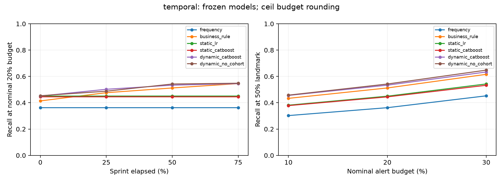
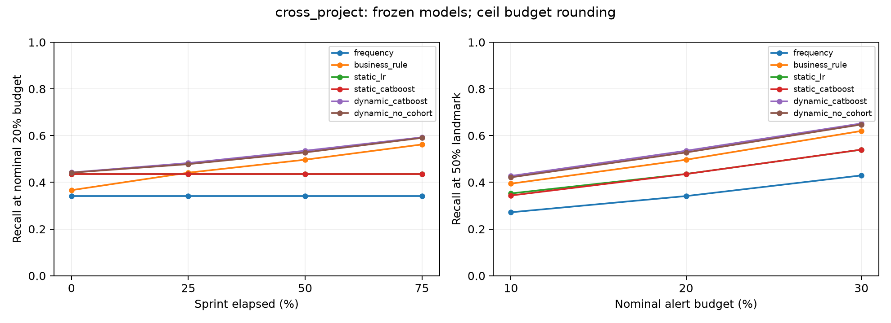
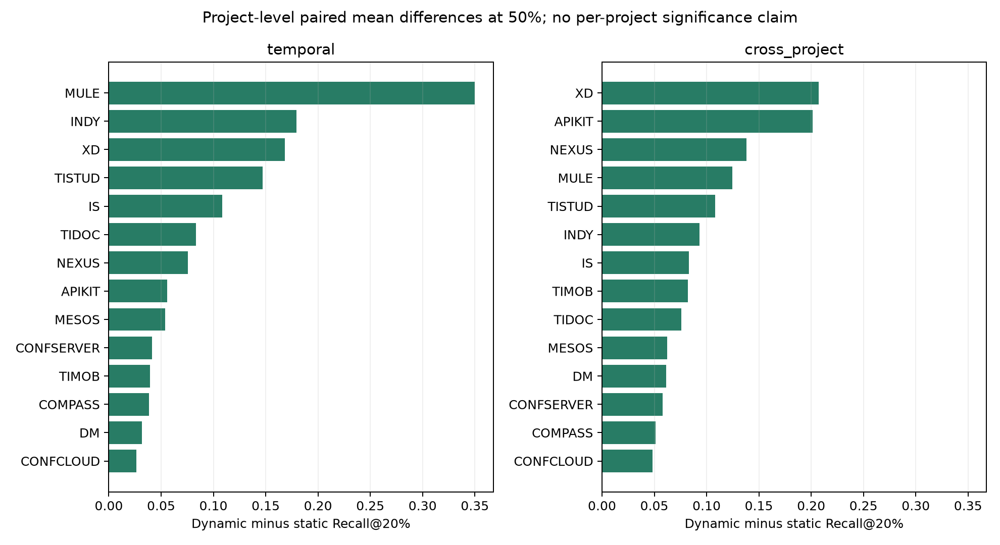
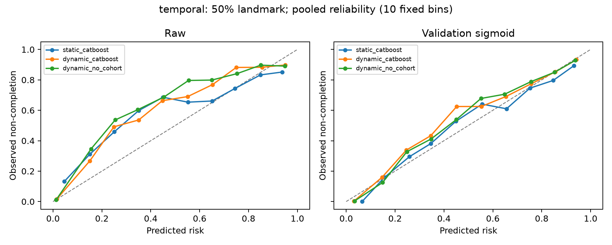
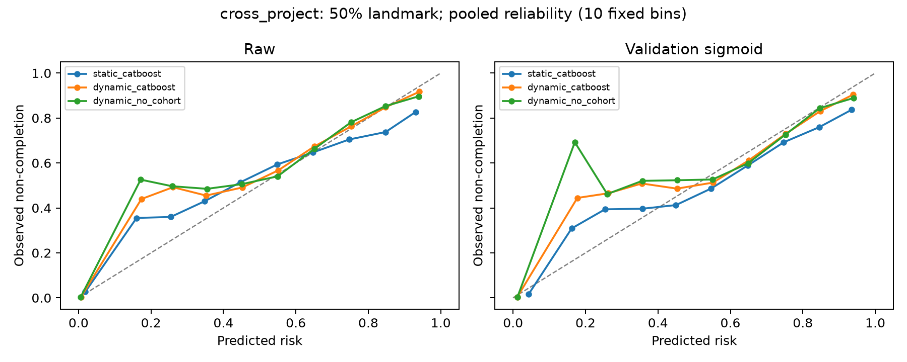

# Báo cáo nghiên cứu đến hết giai đoạn 4

Dự báo sớm outcome issue trong sprint từ execution history và cảnh báo theo ngân sách. Kết quả dưới đây được tạo từ artifact thực nghiệm đã chạy, không phải kết quả dự kiến.

Đọc [thảo luận kết quả và hướng tiếp theo](Thao_luan_ket_qua.md) để xem diễn giải, baseline mạnh, rounding budget, active-only, calibration transfer và các phân tích post-hoc.

## Kết quả chính

**Temporal, H1 đăng ký trước:** Có bằng chứng cải thiện trên thiết lập này: Δ=0.0890, CI 95% [0.0638, 0.1170], 336 đơn vị bootstrap.

**Cross-project, suy rộng phụ:** Có bằng chứng cải thiện trên thiết lập này: Δ=0.0996, CI 95% [0.0753, 0.1282], 14 đơn vị bootstrap.

Chênh lệch là Recall@20% của dynamic CatBoost trừ static CatBoost ở landmark 50%. Temporal bootstrap ghép cặp theo sprint; cross-project theo project. H1 chính chỉ dùng temporal; các landmark/sensitivity khác là phân tích phụ, không chọn kết luận đẹp nhất sau test.

## Bài toán và thiết kế

Đơn vị issue–sprint thuộc tracker scope ở đầu sprint. Tại 0/25/50/75% thời lượng, dự báo xác suất issue chưa Done tại End_Date. RQ1: execution history thêm giá trị gì so với dữ liệu đã biết đầu sprint? RQ2/RQ3: giữ được hiệu quả ở sprint tương lai và project chưa thấy không? RQ4: xác suất và cảnh báo có hữu ích ở giới hạn xử lý không?

Cohort được tái dựng từ Sprint changelog bằng (project_id,jiraid), không dùng liên kết snapshot cuối. Nhãn là last observed status trước/đúng End_Date, Done/Resolved/Closed/Complete; unknown, trạng thái mơ hồ và history gaps không gán nhãn. Feature chỉ lấy event prefix; aggregate cohort tính trước loại outcome NA. Các giả định/giới hạn đầy đủ trong [protocol](Protocol_v1.md) và [data card](Data_card_TAWOS.md).

TAWOS v1.1: 28.746 commitments có membership evidence; 22.147 gán nhãn (77,04%); 88.588 snapshots. Đánh giá chính trên 14 project, 18.322 instances, 1.962 sprints. Temporal có 1.165 train, 383 validation, 397 test, 17 purge; fit riêng project. Cross-project leave-one-project-out, validation project riêng. Cấu hình/model/seed đã khóa trước fit/test; sigmoid chỉ fit validation.

## Xếp hạng và cảnh báo tại giữa sprint

| experiment | model | recall_macro_sprint | recall_macro_project | precision_macro_sprint | false_alerts_per_sprint | realized_budget |
| --- | --- | --- | --- | --- | --- | --- |
| cross_project | business_rule | 0.4825 | 0.4969 | 0.6428 | 0.8007 | 0.3855 |
| cross_project | dynamic_catboost | 0.5228 | 0.5352 | 0.6959 | 0.6463 | 0.3855 |
| cross_project | dynamic_no_cohort | 0.5174 | 0.5280 | 0.6909 | 0.6585 | 0.3855 |
| cross_project | frequency | 0.3472 | 0.3413 | 0.4950 | 1.2100 | 0.3855 |
| cross_project | static_catboost | 0.4372 | 0.4356 | 0.5994 | 0.9067 | 0.3855 |
| cross_project | static_lr | 0.4352 | 0.4360 | 0.5997 | 0.9343 | 0.3855 |
| temporal | business_rule | 0.5123 | 0.5598 | 0.7228 | 0.4861 | 0.4154 |
| temporal | dynamic_catboost | 0.5336 | 0.5768 | 0.7532 | 0.4232 | 0.4154 |
| temporal | dynamic_no_cohort | 0.5423 | 0.5876 | 0.7528 | 0.4156 | 0.4154 |
| temporal | frequency | 0.3625 | 0.3868 | 0.5543 | 0.9270 | 0.4154 |
| temporal | static_catboost | 0.4446 | 0.4769 | 0.6645 | 0.6171 | 0.4154 |
| temporal | static_lr | 0.4499 | 0.4727 | 0.6611 | 0.6297 | 0.4154 |

Ngân sách danh nghĩa 20% dùng ceil(q×n) theo protocol. Realized budget là trung bình tỷ lệ cảnh báo thật trên từng sprint; sprint nhỏ có thể có tỷ lệ cao hơn 20%. Không gọi đây là giới hạn tỷ lệ nghiêm ngặt. Sprint không dương không góp vào macro recall nhưng vẫn góp precision/false alerts. Cross-project ưu tiên macro project khi diễn giải để tránh dự án nhiều sprint chi phối.

| experiment | landmark | scenario | n_units | delta | ci_low | ci_high |
| --- | --- | --- | --- | --- | --- | --- |
| temporal | 0.5000 | primary | 336 | 0.0890 | 0.0638 | 0.1170 |
| cross_project | 0.5000 | primary | 14 | 0.0996 | 0.0753 | 0.1282 |

## Chất lượng xác suất và hiệu chuẩn

| experiment | model | calibration | ap | ap_macro_project | brier | brier_macro_project | calibration_intercept | calibration_slope |
| --- | --- | --- | --- | --- | --- | --- | --- | --- |
| cross_project | business_rule | raw | 0.6911 | 0.6537 | 0.1578 | 0.1584 | 0.1372 | 0.7618 |
| cross_project | business_rule | sigmoid | 0.6833 | 0.6537 | 0.1633 | 0.1658 | -0.0097 | 0.7879 |
| cross_project | dynamic_catboost | raw | 0.8362 | 0.8035 | 0.1374 | 0.1295 | 0.1976 | 0.8899 |
| cross_project | dynamic_catboost | sigmoid | 0.8313 | 0.8035 | 0.1381 | 0.1339 | -0.0040 | 0.9180 |
| cross_project | dynamic_no_cohort | raw | 0.8292 | 0.8025 | 0.1396 | 0.1307 | 0.2222 | 0.8671 |
| cross_project | dynamic_no_cohort | sigmoid | 0.8221 | 0.8025 | 0.1403 | 0.1363 | 0.0254 | 0.9083 |
| cross_project | frequency | raw | 0.4144 | 0.4486 | 0.2542 | 0.2512 | -0.6246 | -2.7171 |
| cross_project | frequency | sigmoid | 0.4593 | 0.4486 | 0.2603 | 0.2662 | -0.1128 | -0.4351 |
| cross_project | static_catboost | raw | 0.6524 | 0.6359 | 0.2257 | 0.2118 | 0.1727 | 0.6711 |
| cross_project | static_catboost | sigmoid | 0.6490 | 0.6359 | 0.2241 | 0.2237 | -0.0901 | 0.7371 |
| cross_project | static_lr | raw | 0.6433 | 0.6170 | 0.2313 | 0.2185 | 0.1366 | 0.5664 |
| cross_project | static_lr | sigmoid | 0.6473 | 0.6170 | 0.2259 | 0.2259 | -0.1025 | 0.7571 |
| temporal | business_rule | raw | 0.8110 | 0.7517 | 0.1407 | 0.1497 | 0.6205 | 1.0507 |
| temporal | business_rule | sigmoid | 0.8632 | 0.7517 | 0.1219 | 0.1413 | 0.1794 | 0.9864 |
| temporal | dynamic_catboost | raw | 0.8764 | 0.8128 | 0.1279 | 0.1394 | 0.5736 | 0.8654 |
| temporal | dynamic_catboost | sigmoid | 0.9000 | 0.8128 | 0.1137 | 0.1340 | 0.0902 | 1.0260 |
| temporal | dynamic_no_cohort | raw | 0.8739 | 0.8253 | 0.1383 | 0.1397 | 0.7470 | 0.8643 |
| temporal | dynamic_no_cohort | sigmoid | 0.8966 | 0.8253 | 0.1155 | 0.1311 | 0.0784 | 1.0659 |
| temporal | frequency | raw | 0.6571 | 0.5148 | 0.2648 | 0.2445 | 0.6241 | 0.7401 |
| temporal | frequency | sigmoid | 0.6793 | 0.5148 | 0.2227 | 0.2293 | 0.0642 | 0.8779 |
| temporal | static_catboost | raw | 0.7633 | 0.6571 | 0.2188 | 0.2307 | 0.4947 | 0.6590 |
| temporal | static_catboost | sigmoid | 0.7908 | 0.6571 | 0.1894 | 0.2085 | 0.0277 | 0.8817 |
| temporal | static_lr | raw | 0.7825 | 0.6578 | 0.1956 | 0.2102 | 0.3710 | 0.6887 |
| temporal | static_lr | sigmoid | 0.7998 | 0.6578 | 0.1858 | 0.2070 | -0.0210 | 0.8618 |

AP là average precision của lớp không hoàn thành, không phải trapezoidal PR area. Brier thấp hơn tốt hơn. Calibration intercept/slope được fit trên test chỉ để chẩn đoán xác suất, không dùng lại để chỉnh mô hình; lý tưởng lần lượt 0 và 1. Khi score là hằng số thì slope/intercept không tách biệt được, nên ghi NA. Reliability plot gộp có thể che khác biệt project, nên phải đọc cùng per-project CSV.

Sigmoid được fit không ràng buộc slope; có 1 artifact ngoài frequency có hệ số âm trên validation (bao gồm các landmark/model). Hệ số âm có thể đảo thứ hạng khi score có biến thiên; frequency hằng số không có ranking để đảo. Phải phân biệt cải thiện do feature với hiệu ứng calibrator; raw scores được giữ nguyên để kiểm tra. Không sửa calibrator theo test trong lượt này.

## Sensitivity và cách diễn giải

| experiment | scenario | n_units | delta | ci_low | ci_high |
| --- | --- | --- | --- | --- | --- |
| temporal | primary | 336 | 0.0890 | 0.0638 | 0.1170 |
| temporal | raw_ranking | 336 | 0.0890 | 0.0638 | 0.1170 |
| temporal | floor | 336 | 0.0382 | 0.0220 | 0.0567 |
| temporal | active_only | 335 | 0.0259 | 0.0068 | 0.0469 |
| temporal | exclude_cancelled_removed | 293 | 0.1046 | 0.0718 | 0.1377 |
| temporal | unseen_issue_ids | 334 | 0.0895 | 0.0641 | 0.1180 |
| temporal | closed_only_label | 377 | 0.0187 | 0.0083 | 0.0304 |
| temporal | project_weighted_exploratory | 14 | 0.0999 | 0.0611 | 0.1492 |
| cross_project | primary | 14 | 0.0996 | 0.0753 | 0.1282 |
| cross_project | raw_ranking | 14 | 0.0996 | 0.0753 | 0.1282 |
| cross_project | floor | 14 | 0.0609 | 0.0434 | 0.0809 |
| cross_project | active_only | 14 | 0.0203 | 0.0073 | 0.0358 |
| cross_project | exclude_cancelled_removed | 14 | 0.1027 | 0.0757 | 0.1373 |
| cross_project | unseen_issue_ids | 14 | 0.0996 | 0.0753 | 0.1282 |
| cross_project | closed_only_label | 14 | 0.0195 | 0.0032 | 0.0381 |

| experiment | model | scenario | n | ap | brier | recall_macro_sprint | realized_budget |
| --- | --- | --- | --- | --- | --- | --- | --- |
| cross_project | dynamic_catboost | raw_ranking | 18322 | 0.8362 | 0.1374 | 0.5228 | 0.3855 |
| cross_project | dynamic_catboost | floor | 18322 | 0.8313 | 0.1381 | 0.2155 | 0.0985 |
| cross_project | dynamic_catboost | active_only | 12697 | 0.8320 | 0.1976 | 0.4520 | 0.4227 |
| cross_project | dynamic_catboost | exclude_cancelled_removed | 15881 | 0.7930 | 0.1447 | 0.5171 | 0.4016 |
| cross_project | dynamic_catboost | unseen_issue_ids | 18322 | 0.8313 | 0.1381 | 0.5228 | 0.3855 |
| cross_project | dynamic_catboost | closed_only_label | 18322 | 0.9392 | 0.3160 | 0.4186 | 0.3855 |
| cross_project | static_catboost | raw_ranking | 18322 | 0.6524 | 0.2257 | 0.4372 | 0.3855 |
| cross_project | static_catboost | floor | 18322 | 0.6490 | 0.2241 | 0.1615 | 0.0985 |
| cross_project | static_catboost | active_only | 12697 | 0.7872 | 0.2341 | 0.4387 | 0.4227 |
| cross_project | static_catboost | exclude_cancelled_removed | 15881 | 0.5935 | 0.2297 | 0.4314 | 0.4016 |
| cross_project | static_catboost | unseen_issue_ids | 18322 | 0.6490 | 0.2241 | 0.4372 | 0.3855 |
| cross_project | static_catboost | closed_only_label | 18322 | 0.8851 | 0.2840 | 0.4015 | 0.3855 |
| temporal | dynamic_catboost | raw_ranking | 3293 | 0.8764 | 0.1279 | 0.5336 | 0.4154 |
| temporal | dynamic_catboost | floor | 3293 | 0.9000 | 0.1137 | 0.1820 | 0.0845 |
| temporal | dynamic_catboost | active_only | 2415 | 0.9007 | 0.1516 | 0.4779 | 0.4480 |
| temporal | dynamic_catboost | exclude_cancelled_removed | 2829 | 0.9022 | 0.1125 | 0.5285 | 0.4275 |
| temporal | dynamic_catboost | unseen_issue_ids | 3273 | 0.8990 | 0.1140 | 0.5311 | 0.4180 |
| temporal | dynamic_catboost | closed_only_label | 3293 | 0.9588 | 0.2617 | 0.4414 | 0.4154 |
| temporal | static_catboost | raw_ranking | 3293 | 0.7633 | 0.2188 | 0.4446 | 0.4154 |
| temporal | static_catboost | floor | 3293 | 0.7908 | 0.1894 | 0.1438 | 0.0845 |
| temporal | static_catboost | active_only | 2415 | 0.8802 | 0.1847 | 0.4520 | 0.4480 |
| temporal | static_catboost | exclude_cancelled_removed | 2829 | 0.7937 | 0.1868 | 0.4240 | 0.4275 |
| temporal | static_catboost | unseen_issue_ids | 3273 | 0.7897 | 0.1900 | 0.4416 | 0.4180 |
| temporal | static_catboost | closed_only_label | 3293 | 0.9062 | 0.2485 | 0.4228 | 0.4154 |

Raw-ranking giữ ranking model base trước calibrator. Project-weighted exploratory đổi trọng số thành project ngang nhau và bootstrap theo project, khác estimand macro sprint của H1. Floor budget áp giới hạn tỷ lệ nghiêm ngặt và có thể không phát cảnh báo ở sprint nhỏ. Active-only chỉ xét issue chưa Done tại landmark, là kiểm tra giá trị dự báo trong công việc còn mở. Loại cancelled/removed kiểm tra mức phụ thuộc scope change. Unseen-ID loại issue test đã có trong train, không phải dự án chưa thấy. Closed-only ở đây chỉ chấm lại frozen predictions với target thay thế; mô hình chưa được retrain cho target đó, nên đây là stress test nhãn, không là so sánh learner được tối ưu cho Closed-only.

## Cảnh báo tích lũy và độ sớm

| experiment | model | recall_macro_sprint | recall_macro_project | precision_macro_sprint | false_alerts_per_sprint | lead_days_macro_sprint | recall_by_half_macro |
| --- | --- | --- | --- | --- | --- | --- | --- |
| temporal | frequency | 0.4497 | 0.4944 | 0.6900 | 0.5542 | 8.1425 | 0.4226 |
| temporal | business_rule | 0.4928 | 0.5363 | 0.7381 | 0.4458 | 8.1582 | 0.4630 |
| temporal | static_lr | 0.5079 | 0.5408 | 0.7655 | 0.4030 | 8.1784 | 0.4789 |
| temporal | static_catboost | 0.5027 | 0.5422 | 0.7661 | 0.3829 | 8.2334 | 0.4748 |
| temporal | dynamic_catboost | 0.5156 | 0.5568 | 0.7767 | 0.3552 | 8.3009 | 0.4861 |
| temporal | dynamic_no_cohort | 0.5118 | 0.5515 | 0.7712 | 0.3577 | 8.3604 | 0.4841 |
| cross_project | frequency | 0.4481 | 0.4559 | 0.6315 | 0.8073 | 8.5125 | 0.4025 |
| cross_project | business_rule | 0.4633 | 0.4779 | 0.6489 | 0.7701 | 8.4943 | 0.4170 |
| cross_project | static_lr | 0.4997 | 0.5058 | 0.7025 | 0.6397 | 8.7189 | 0.4566 |
| cross_project | static_catboost | 0.4961 | 0.4986 | 0.6948 | 0.6402 | 8.6824 | 0.4513 |
| cross_project | dynamic_catboost | 0.5074 | 0.5174 | 0.7125 | 0.5973 | 8.6300 | 0.4601 |
| cross_project | dynamic_no_cohort | 0.5031 | 0.5158 | 0.7060 | 0.6137 | 8.6837 | 0.4571 |

Replay dùng tổng cap ceil(20%×n) cho cả sprint, không reset ở mỗi landmark. Cumulative quota 1/3, 2/3 và toàn cap tại 25/50/75%; deduplicate issue và không cảnh báo issue đã Done tại thời điểm đó. Lead time chỉ tính true alerts được phát hiện và mean theo sprint; không phải mọi issue rủi ro đều được phát hiện. Đây là policy cố định minh họa capacity/earliness, chưa chứng minh tối ưu hay tác động can thiệp.

## Threats to validity và phạm vi kết luận

- Nhãn archival có coverage 77,04%; loại NA có thể tạo selection bias. Không có hai người xác minh workflow, không báo cáo inter-rater agreement giả. SQL/replay consistency không thay thế ground truth nghiệp vụ.
- Sprint Start/End lấy từ snapshot, không có lịch sử đổi ngày sprint. Tính hợp lệ của deadline biết tại t0 là giả định; kiểm tra timestamp event không tự chứng minh giả định này. Metadata project/ownership cũng theo snapshot.
- Missing logs có thể không để lại dấu chuỗi sai. Static priority/type/estimate thiếu nhiều vì không lấy final values; so sánh phản ánh thông tin tái dựng được, không mọi thông tin team thực sự có.
- Cross-project là transfer archival, không cutoff triển khai toàn cầu. Project cùng repository có thể cùng workflow nên project holdout chưa tương đương organization holdout.
- Bootstrap sprint giữ pairing nhưng issue có thể lặp qua sprint; sensitivity seen-ID giảm một phần phụ thuộc, không loại toàn bộ clustering.
- Nhiều phân tích phụ không điều chỉnh multiplicity và không thay thế H1 chính. Không tuyên bố thuật toán mới/SOTA; cấu hình cố định chưa là exhaustive hyperparameter search.
- Offline replay không cho biết cảnh báo có giảm trễ hoặc ảnh hưởng hành vi người dùng; cần pilot và dữ liệu live ở các giai đoạn sau.

## Tái lập và kiểm tra hoàn thành

Matrix: 672 prediction files; validation 672/672 bộ artifact, đối chiếu cohort/nhãn/timestamp/feature whitelist và re-inference mẫu. Config hash `da99425674f8bbff7a95f8e13c2abb7bd0a4e74cc2f0acdc3fbc6eb043f3c793`; dataset hash `a491b23cc03f0777e8a8b33a19cbcfe1843aa6b019e2634fc8a90b38e61d084f`.

[Hướng dẫn chạy lại](Reproduce_research.md), [checklist/decision log](Research_progress.md), [căn cứ học thuật](Literature_and_methods.md), [BibTeX](references.bib). Model/parquet lưu local và được Git ignore; CSV/protocol/code/report được tracking. Kết quả này hoàn thành nghiên cứu offline đến giai đoạn 4; tích hợp Agentick và pilot là giai đoạn 5 trở đi.

## Hướng sử dụng cho sản phẩm

Thiết kế dashboard ưu tiên xếp hạng issue còn mở theo budget cấu hình của sprint, hiển thị số cảnh báo thực tế, landmark/model version và trạng thái dữ liệu thiếu. Xác suất nên đi kèm calibration theo project; không dùng một ngưỡng xác suất chung như cam kết chắc chắn về rủi ro. Giữ log prediction/alert để đánh giá drift và false alerts khi pilot. Các artifact hiện có là model theo fold đánh giá, chưa phải một model production đã được chọn/huấn luyện lại trên toàn dữ liệu.
